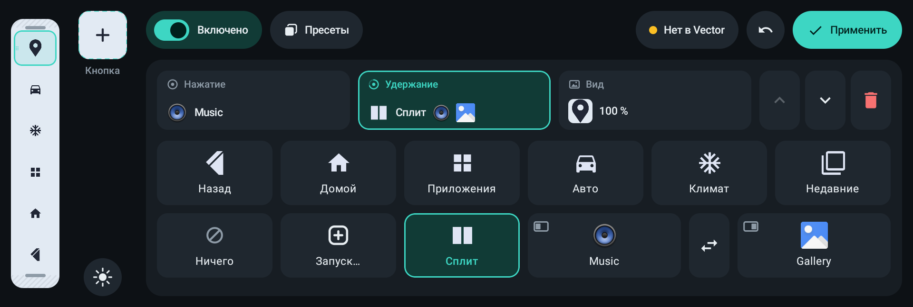
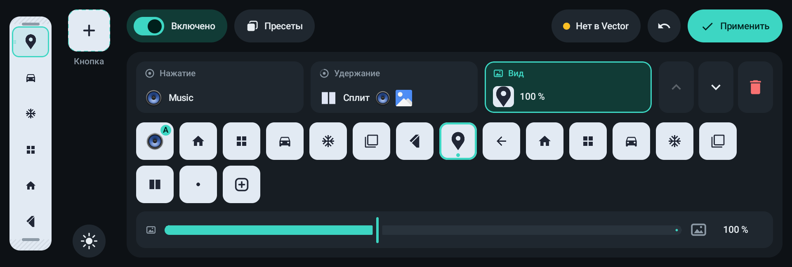
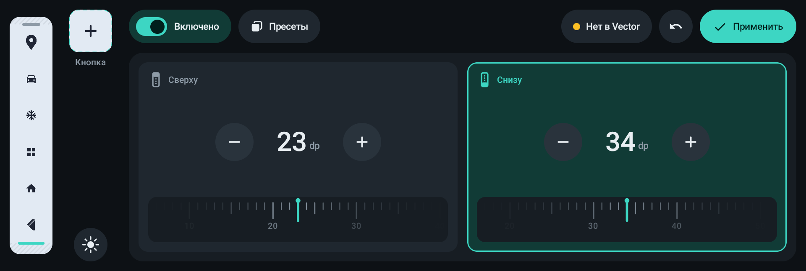
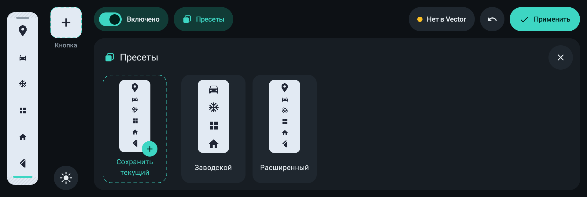
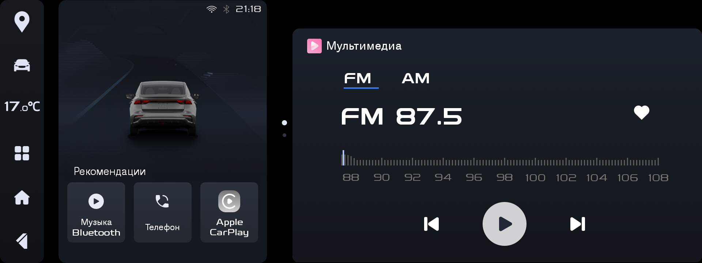

# GeelyNavbar — своя боковая панель для ГУ Geely / ecarx

Модуль LSPosed (Xposed) для головных устройств Geely на платформе ecarx с Android 9. Меняет кнопки штатной боковой панели слева: какие кнопки стоят, в каком порядке, что делают по нажатию и по удержанию, как выглядят и где стоит виджет климата. Всё настраивается в приложении с экраном под палец и применяется без перезагрузки. Системные файлы и штатные APK модуль не трогает: стоит его выключить, и панель снова заводская.

> **English.** An LSPosed/Xposed module for Geely head units on the ecarx platform (Android 9) that lets you rebuild the stock left-side navigation panel: choose the buttons and their order, tap and long-press actions (back, home, recents, any app, two apps in split screen, stock climate/car/app windows), icons and the position of the climate widget. Configured in a touch-friendly app and applied live; disabling the module restores the stock panel. The UI is in Russian.



## Возможности

- **Любой набор кнопок.** До 12 пунктов, их порядок и виджет климата можно передвинуть или убрать.
- **Два действия на кнопку:** нажатие и удержание.
  - «Назад», «Домой», «Недавние».
  - Штатные окна: панель приложений, настройки автомобиля, окно климата.
  - Запуск любого приложения.
  - **Сплит:** два выбранных приложения слева и справа. Уже открытые приложения не перезапускаются.
- **Иконки:** штатные PNG панели, набор своих векторных иконок (в том числе «Карта» и «Назад», как в популярном моде SX11) или иконка любого приложения. Днём и ночью цвет меняется вместе со штатными. Масштаб каждой иконки и виджета климата настраивается от 30 до 200 %.
- **Отступы колонки** сверху и снизу с точностью до 1 dp, чтобы раскладка совпала со штатной или с модом.
- **Пресеты:** «Заводской», «Расширенный» (раскладка мода SX11) и свои наборы.
- **Применение на лету:** «Применить» пересобирает панель за доли секунды, SystemUI не перезапускается.
- **Безопасный откат:** если настройки битые или что-то пошло не так, остаётся штатная панель, а причина пишется в журнал.

## Совместимость

| | |
|---|---|
| Устройство | ГУ ecarx с боковой панелью от плагина `com.ecarx.systemui.plugin`. Проверено на Geely Emgrand (SS11) / Belgee S50, ГУ IHU718P |
| Android | 9 (API 28) |
| Панель | Штатный плагин и мод SX11 (модифицированный `NSSystemUIplugin.apk`) |
| Root | Magisk с включённым Zygisk |
| Фреймворк | LSPosed-совместимый, API ≥ 93. Проверено на [Vector](https://github.com/JingMatrix/Vector) v2.2 — форке LSPosed от JingMatrix |

Если на прошивке нет нужных классов плагина, модуль ничего не делает и пишет об этом в журнал фреймворка.

## Установка

1. Поставьте Magisk, включите Zygisk и установите LSPosed-совместимый фреймворк (например, Vector), затем перезагрузите ГУ.
2. Скачайте `GeelyNavbar-*.apk` со страницы [Releases](../../releases) и установите его.
3. Включите модуль «Боковая панель» в менеджере фреймворка. Скоуп `com.android.systemui` (Системный интерфейс) предлагается сам — проверьте, что он отмечен.
   С консоли Vector то же самое:
   ```sh
   su -c '/data/adb/modules/zygisk_vector/cli modules enable com.github.vorobeyyyyyy.geelynavbar'
   su -c '/data/adb/modules/zygisk_vector/cli scope set com.github.vorobeyyyyyy.geelynavbar com.android.systemui/0'
   ```
4. Перезапустите SystemUI: перезагрузите ГУ или выполните `su -c 'kill $(pidof com.android.systemui)'`. Панель и статус-бар пропадут на пару секунд, затем система сама поднимет их заново.
5. Откройте приложение «Боковая панель». Статус наверху должен показать «Работает». Если там «Нет в Vector» или «Нет связи», модуль не включён или SystemUI не перезапущен — подробности по нажатию на статус. Включите выключатель, соберите панель и нажмите «Применить».

В журнале фреймворка после перезапуска SystemUI должна появиться строка `GeelyNavbar 1.0.0: хук на панели (через …)`. Пока своя панель не включена в приложении, панель остаётся штатной.

> На этих ГУ любая установка APK роняет штатный `com.android.car` с ошибкой «println needs a message». Это баг прошивки: сервис сам перезапускается, к модулю это отношения не имеет.

## Настройка

Слева — копия панели, она же редактор. Справа — настройки выбранного пункта. Сверху — общий выключатель, пресеты, статус модуля и «Применить».

- **Нажатие** на пункт копии выбирает его. **Удержание** поднимает пункт: его можно перенести на другое место или в лоток, тогда он убирается с панели.
- **Лоток** («+ Кнопка», «Климат») добавляет пункты: нажатием — в конец, перетаскиванием — в нужное место.
- Карточки **«Нажатие» / «Удержание» / «Вид»** — одновременно сводка и вкладки. У «Сплита» под плиткой выезжают половины «Слева» и «Справа», ⇄ меняет их местами.
- **Отступы** колонки показаны штриховкой. Ручки двигают их грубо, а касание ручки или штриховки открывает точную настройку: «−»/«+» с повтором при удержании и линейка.
- ☀ переключает превью между днём и ночью.
- Подтверждений «Вы уверены?» нет: удаление и применение пресета можно отменить из снэкбара («Вернуть»), несохранённые правки — кнопкой ↶.

| Вид кнопки | Отступы | Пресеты |
|---|---|---|
|  |  |  |

Панель на ГУ (раскладка «Расширенный»):



## Действия

Все действия выполняются внутри процесса SystemUI, поэтому ни su, ни дополнительные разрешения приложению не нужны.

| Действие | Что происходит |
|---|---|
| Назад | Клавиша BACK |
| Домой | Клавиша HOME. Открывается рабочий стол по умолчанию: штатный, AutoEasy или другой |
| Приложения | Штатная панель приложений (часть `ecarx.launcher3`), открыть или закрыть |
| Авто | Штатные настройки автомобиля `ecarx.settings` |
| Климат | Главное окно климата `ecarx.hvac.app` (через его AIDL-сервис) |
| Недавние | `RecentsActivity` SystemUI. Если она не открылась — клавиша APP_SWITCH |
| Запуск | Выбранное приложение (или конкретная activity) |
| Сплит | Левое и правое приложения раскладываются по половинам экрана, см. ниже |
| Ничего | Пустая кнопка. Для удержания — удержание не перехватывается |

Перед каждым действием закрываются штатные окна (климат, настройки авто, панель приложений) так же, как в стоке. Повторное нажатие раньше чем через 400 мс игнорируется — так же работает штатная панель.

## Как это работает

Панель рисует не сам SystemUI, а плагин ecarx `com.ecarx.systemui.plugin`. SystemUI загружает его код в свой процесс через `createPackageContext(…, CONTEXT_INCLUDE_CODE)`, поэтому скоуп модуля — `com.android.systemui`. Хук ставится на загрузчик плагина: фреймворк сообщает о загрузке вторичного пакета, а запасной путь — хук на `ContextImpl.createPackageContextAsUser`.

- **`NavigationBarView.onFinishInflate`** (после). В контейнер `mNavContent` кладётся своя вертикальная колонка, где пункты делят высоту поровну за вычетом отступов. Виджет климата (`hvacBar`) переносится в свою ячейку. Штатные кнопки, в том числе кнопки мода, снимаются только после того, как колонка собрана целиком. При любой ошибке дерево view возвращается в исходное состояние.
- **`NavigationBarView.onUIModeChanged`** (после). Иконки перерисовываются под день или ночь.
- Кнопки — экземпляры штатного `AlphaImageView`, поэтому на нажатие реагируют так же, как штатные.
- Иконки приложений ищутся с флагами `MATCH_DIRECT_BOOT_*`: SystemUI создаёт панель до разблокировки пользователя. После `USER_UNLOCKED` и при установке или обновлении приложений иконки перерисовываются.

**Настройки.** Приложение пишет конфиг в `SharedPreferences` с `MODE_WORLD_READABLE`, фреймворк перенаправляет их в свою папку, и хук читает их через `XSharedPreferences`. «Применить» шлёт в SystemUI broadcast `…RELOAD`. Хук перечитывает настройки, пересобирает панель и отвечает `…PONG` со статусом: версия, сколько пунктов на экране, ошибка. По этому ответу приложение показывает статус модуля.

**Сплит** (`hook/SplitScreen.kt`) выполняется скрытыми вызовами `IActivityManager` с правами SystemUI (MANAGE_ACTIVITY_STACKS):
1. Закрыть открытый сплит.
2. Открыть правое приложение, поверх него — левое.
3. Перевести задачу левого в левую половину (`setTaskWindowingModeSplitScreenPrimary`).
4. Повторно задать границы левой половины (`resizeDockedStack`). Без этого уже открытое правое приложение на Android 9 остаётся во весь экран и обрезается разделителем.

Флаг прошивки `enable_split_from_ui`, которым пользуется мод SX11, не используется: какие приложения он раскладывает, решает прошивка. Здесь пару выбирает пользователь.

<details>
<summary><b>Формат конфига</b></summary>

Весь конфиг — один JSON под ключом `config` в `navbar.xml` (разбор — `NavConfig.kt`):

```json
{
  "version": 1,
  "enabled": true,
  "paddingTop": 23,
  "paddingBottom": 34,
  "items": [
    {"type": "button", "tap": {"type": "app", "package": "ru.yandex.yandexnavi"},
     "long": {"type": "split", "left": {"type": "app", "package": "ru.yandex.yandexnavi"}, "right": {"type": "app", "package": "ru.yandex.music"}},
     "icon": {"type": "named", "name": "nb_map"}},
    {"type": "hvac", "scale": 100},
    {"type": "button", "tap": {"type": "back"}, "long": {"type": "none"}, "icon": {"type": "auto"}, "scale": 110}
  ]
}
```

- **Действия:** `none`, `back`, `home`, `apps`, `car`, `climate`, `recents`, `app` (+ `package`, необязательный `activity`), `split` (+ `left` и `right` в виде действия `app`).
- **Иконки:** `auto` (по действию), `named` (+ `name`: штатные `ic_nav_*` или свои `nb_*`), `app` (+ `package`, `activity`).
- **`scale`** — 30–200 %. У кнопки масштабируется только картинка, у виджета климата — весь виджет в пределах своей ячейки.
- **`paddingTop` / `paddingBottom`** — 0–300 dp.
- Разбор прощающий:
  - неизвестное действие становится `none`, неизвестная иконка — `auto`;
  - непонятные пункты, второй виджет климата и пункты сверх 12 отбрасываются;
  - числа вне диапазона приводятся к границе;
  - если это не JSON или нет `items`, панель остаётся штатной.

</details>

## Откат и удаление

- В приложении переведите выключатель в «Выключено» и нажмите «Применить» — штатная панель вернётся сразу.
- Или выключите модуль в менеджере фреймворка и перезапустите SystemUI.
- Чтобы удалить модуль, удалите приложение и перезапустите SystemUI или ГУ.

## Ограничения и статус

- Ширина и сторона панели не меняются: 160 dp слева задаёт сам SystemUI.
- Пункты делят высоту поровну. Неравные промежутки, как у мода, повторяются только приблизительно, отступами колонки.
- Виджет климата один: его можно передвинуть, масштабировать или убрать, но не продублировать.
- **На ГУ проверены:**
  - своя панель поверх мода SX11 и откат к штатной;
  - виджет климата в колонке;
  - «Назад», «Приложения» и запуск приложений.
- **Ещё не проверены на машине:**
  - сплит в последней версии: в предыдущей правая половина была обрезана, исправление проверено пока только на эмуляторе;
  - окно климата, «Недавние», «Настройки авто»;
  - «Домой» со сторонним рабочим столом;
  - смена дня и ночи;
  - скрытие панели при CarPlay.

  Если у вас что-то из этого не работает, приложите журнал (`adb logcat -s GeelyNavbar:* VectorLegacyBridge:*`) к issue.

## Сборка

Нужны JDK 17 и Android SDK (путь к нему — в `local.properties`: `sdk.dir=…`).

```sh
./gradlew assembleRelease          # app/build/outputs/apk/release/app-release.apk
./gradlew testDebugUnitTest        # JVM-тесты: разбор и запись конфига, выбор приложений в редакторе
./gradlew connectedDebugAndroidTest  # на эмуляторе с Android 9: сборка и откат панели, сигнатуры скрытых API сплита
```

Xposed API подключён как `compileOnly` (`de.robv.android.xposed:api:82` с `api.xposed.info`) и в APK не попадает. Release-сборка сжимается R8, точка входа сохранена в `proguard-rules.pro`.

Для тестов сплита на эмуляторе скрытые API нужно открыть: перед прогоном выполните `adb shell settings put global hidden_api_policy_p_apps 1`, после — `adb shell settings delete global hidden_api_policy_p_apps`. Без этого тесты сплита пропускаются.

**Подпись.** Без настроек release подписывается debug-ключом. Для своего ключа положите в корень `keystore.properties` (в git не попадает):

```properties
storeFile=release.jks
storePassword=…
keyAlias=…
keyPassword=…
```

APK с другой подписью не установится поверх уже установленного. Перед сменой ключа удалите приложение — настройки панели при этом тоже удалятся.

## Структура

| | |
|---|---|
| `hook/Entry.kt` | Точка входа Xposed (`assets/xposed_init`): процесс SystemUI, загрузчик плагина, запасной путь |
| `hook/PanelHook.kt` | Хуки на `NavigationBarView`, `XSharedPreferences`, `PING` / `RELOAD` / `PONG` |
| `hook/NavPanel.kt` | Сборка своей колонки и возврат стока. Не зависит от Xposed, поэтому тестируется на эмуляторе |
| `hook/Actions.kt`, `hook/SplitScreen.kt` | Действия кнопок, связь с климатом, сплит |
| `NavConfig.kt`, `Icons.kt`, `Protocol.kt` | Модель и JSON-конфиг, иконки (общие для хука и превью), константы обмена |
| `ui/` | Экран настройки на Jetpack Compose: редактор-копия панели, перетаскивание, инспектор, отступы, пресеты |
| `res/drawable/nb_*.xml` | Свои векторные иконки панели |

## Лицензия

[MIT](LICENSE).

Проект не связан с Geely, ecarx и авторами мода SX11. Названия и товарные знаки принадлежат их владельцам. Модуль меняет системный интерфейс автомобиля: используйте его на свой риск и не настраивайте панель на ходу.
